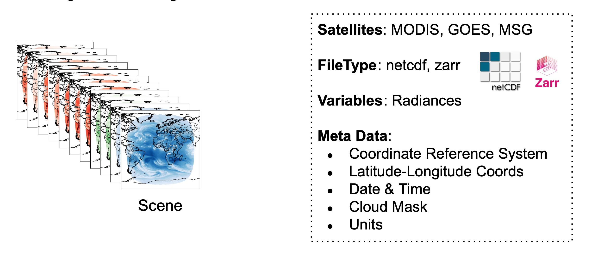
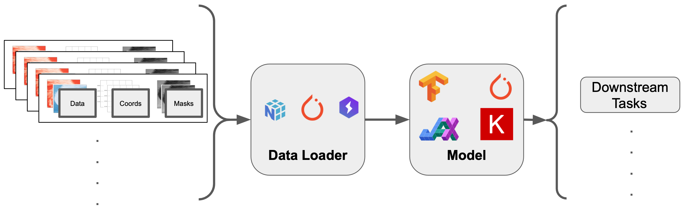

# `rs-tools`


## What are RS-Tools?

`rs_tools` is a toolbox of functions designed to 
There is a high barrier to entry when working with remote sensing data for machine learning (ML) research.
This is especially true for level 1 data which is typically raw radiance observations.
There are often many domain-specific transformations that can completely make or break the success of the ML task.
`rs_tools` seeks to lower the barrier to entry cost for ML researchers to make meaningful progress when dealing with remote sensing data. 
It features a standardized, transparent and flexible procedure for defining data and evaluation pipelines for data-intensive level 1 data products.

***
### Agnostic Toolbox of Functions

We provide a suite of useful functions which can be used to clean level-1 remote sensing data to be used for downstream tasks.
It is an agnostic suite of functions that can be piped together to create preprocessing and evaluation chains.
We take care of all of the nitty-gritty details which are often common for these types of datasets.
However, we take care not to hard-code anything and try to be as transparent as possible so that users can understand and modify the scripts for their own use cases.

***
### Pipelines

We provide some hydra-integrated pipelines which allow users to do some high-level processing to produce ML-ready datasets.
We follow best principles to be as agnostic as possible so that users are not bound by any ML-framework.
In addition, we provide many small bite-sized functions which users can piece together in their own way for their own applications.


***
#### Data Downloader

With a few simple commands, we can download some raw level 1 data products with minimum preprocessing.
We currently have data downloaders for [MODIS Level 1](https://spaceml-org.github.io/rs_tools/datasets/modis) data, [MSG Level 1](https://spaceml-org.github.io/rs_tools/datasets/msg) data, and [GOES16 Level 1](https://spaceml-org.github.io/rs_tools/datasets/goes/) data.


A user can get started right away by simply running the following snippet in the command line.

```bash
# GOES 16
python rs_tools satellite=goes stage=download
# MODIS - AQUA (or TERRA)
python rs_tools satellite=aqua stage=download
# MSG
python rs_tools satellite=msg stage=download
```


***
#### Analysis-Ready Data

We have scripts to generate some *analysis-ready data*.
These are datasets that have been harmonized under a common data structure.
We try to keep as much meta-data as possible which could be useful for downstream tasks, e.g., coordinates, time stamps, units and cloud masks.
A user can do some further analysis on these

<center>
    
</center>

A user can get started right away by simply running the following snippet in the command line.

```bash
# GOES16
python rs_tools satellite=goes stage=geoprocess
# MODIS - AQUA (or TERRA)
python rs_tools satellite=aqua stage=geoprocess
# MSG
python rs_tools satellite=msg stage=geoprocess
```

For more examples, see our pipelines sections for MODIS, MSG and GOES16.

***
#### Machine-Learning Ready Data

We also feature some *ML-Ready* data which is immediately ready for ML-specific tasks.
These are data that have already been divided into patches which sufficiently span the space for the ML task.
A user can user whichever ML dataset/dataloader framework that they choose.


<center>
    
</center>

A user can get started right away by simply running the following snippet in the command line.

```bash
# GOES16
python rs_tools satellite=goes stage=patch
# MODIS - AQUA (or TERRA)
python rs_tools satellite=aqua stage=patch
# MSG
python rs_tools satellite=msg stage=patch
```

***
#### Use Case: Instrument-to-Instrument Translation (Work In Progress)

We also feature an Instrument-2-Instrument translation use-case.
See [github/InstrumentToInstrument](https://github.com/RobertJaro/InstrumentToInstrument/tree/master) repo for more details.
In the rs-tools library, we have a simple example training script.


```bash
python rs_tools ...
```

***
## Installation

### Conda (Recommended)

We recommend the user to use `conda` with the associated environment for the environment.

```bash
conda env create -f environments/environment.yaml
conda activate rs_tools
```

***
### Pip (Alpha-Version)

We can install via the github repo through pip.

```bash
pip install git+https://github.com/space-ml/rs_tools.git
```

**Warning**: This is an alpha version.

***
### Development Version


```bash
git clone https://github.com/space-ml/rs_tools.git
cd rs_tools
poetry install
```

!!! tip 
    We advise you to create a virtual environment before installing:

    ```bash
    conda env create -f environment.yaml
    conda activate rs_tools
    ```

    and recommend you check your installation passes the supplied unit tests:

    ```bash
    poetry run pytest tests/
    ```

***
### Instrument To Instrument (Work-in-Progress)

We have an example where we could do inference using a pre-trainined model from the ITI repo.
This would require us to install the `itipy` repo directly.

We can use


```bash
conda env create -f environments/environment_iti.yaml
conda activate rs_tools
```


Please see the [InstrumentToInstrument](https://github.com/spaceml-org/InstrumentToInstrument/tree/development-eo) repo with the [example](https://github.com/spaceml-org/InstrumentToInstrument/blob/development-eo/iti/train/msg_to_goes.py) for more details.


---
## References

**Software**

* [InstrumentToInstrument](https://github.com/RobertJaro/InstrumentToInstrument/tree/master) - Instrument-to-Instrument Translation.